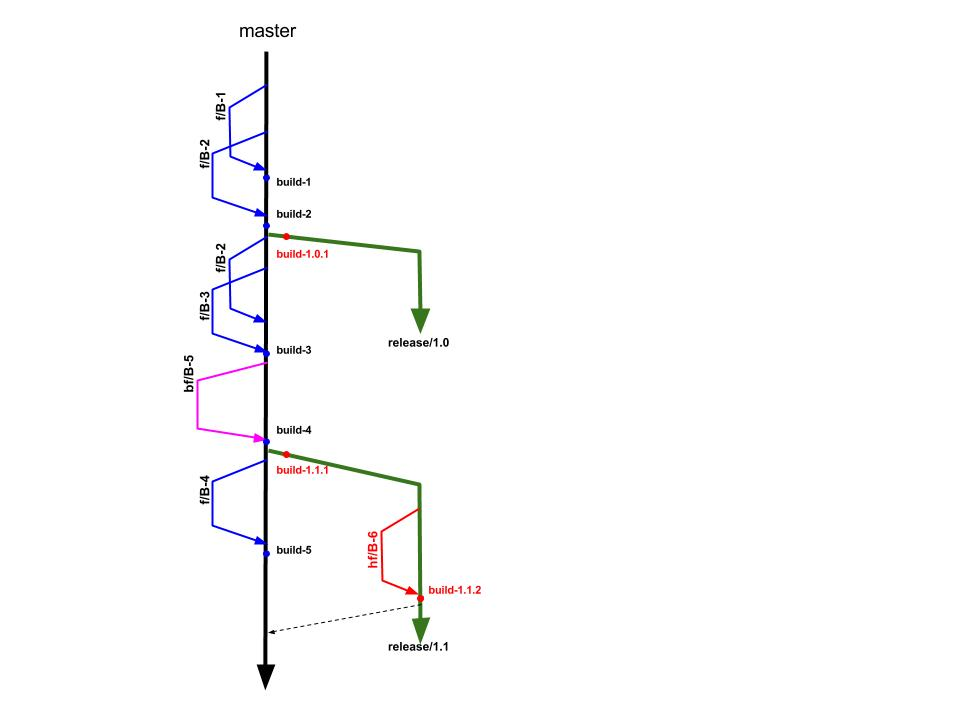

# Python Selenium Automation repository

Code Repository for Python Selenium Automation

## Repository structure 

    * etc - configuration information for application
    * bin - python, shell, binaries, etc
    * lib - bee libraries if any, avoid of placing opensource and system libraries here
    * sql - scripts for creating database objects
    * sys - initial setup, system startup/shutdown definitions

## Branching model
Traditional Git Flow Branching model:

  * master - the only persistent branch, direct commits are forbiden only merges via pull-requests from feature branches can deliver changes

  * release/N.N - created from master and  represent stable release deployed to production

  * feature and bugfix - define a releasable unit of work and directly represent all code changes related to particular JIRA ticket (enhancement or bugfix).The intention behind these branches is that they are an isolated set of code changes for the time of development untill the code is stable and merged. Development branches are always short lived. Feature & Bugifx branches are almost the same, branch type is used only for intent indication

  * hotfix - dedicated branches for delivering changed to the issued release, hotfix branch is created from Relese branch and inteded to be merge to bach to release branch via pull request
